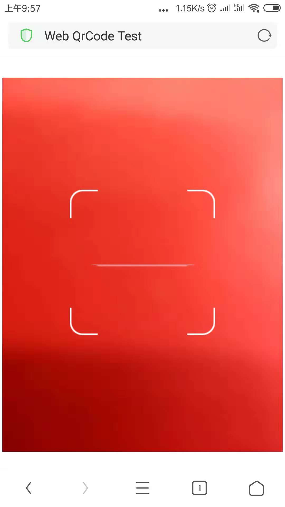

JavaScript QRCode reader for HTML5 enabled browser.
2011 Lazar Laszlo  http://lazarsoft.info

Try it online: http://webqr.com

This is a port of ZXing qrcode scanner, http://code.google.com/p/zxing.

# Download

  git clone https://github.com/shiwenna/jsqrcode.git

# Usage

文件放到http服务器中访问qrcode.html即可

*例：放到http-server中*

*安装http-server*

```npm install http-server -g ```

*使用http-server*

找到你的文件夹,在当前文件夹下打开命令行,输入http-server,默认启动8080端口

访问：http://127.0.0.1:8080/src/qrcode.html

效果图：



结果：

二维码若为URL则自动跳转页面，否则弹框显示二维码内容。

